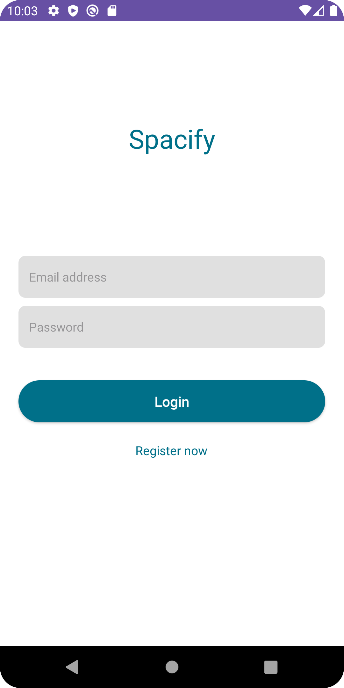
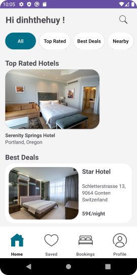
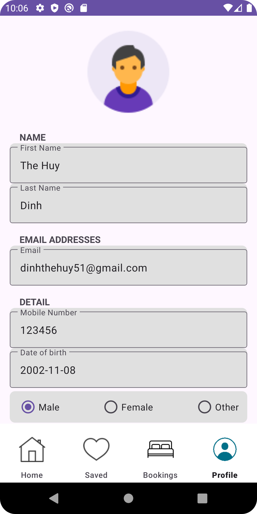
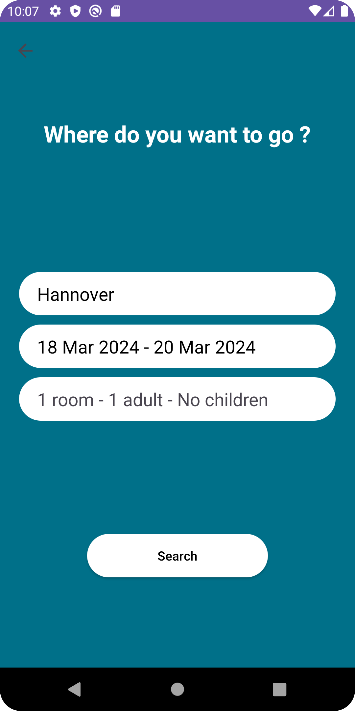
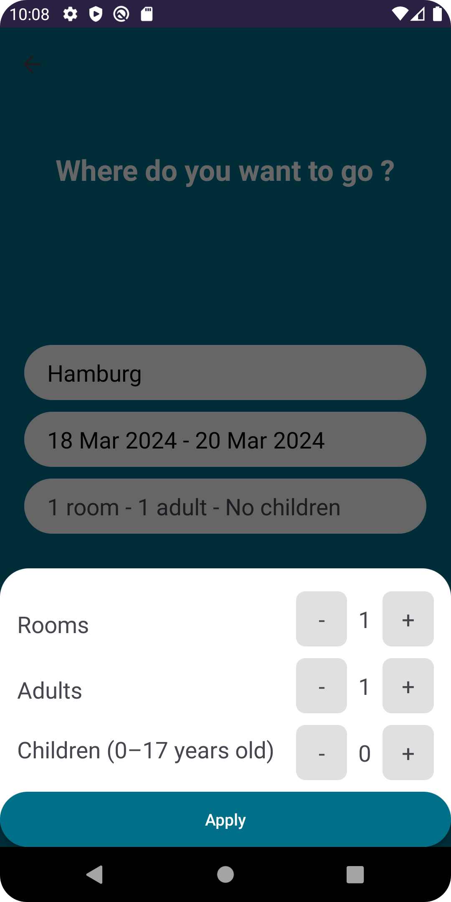
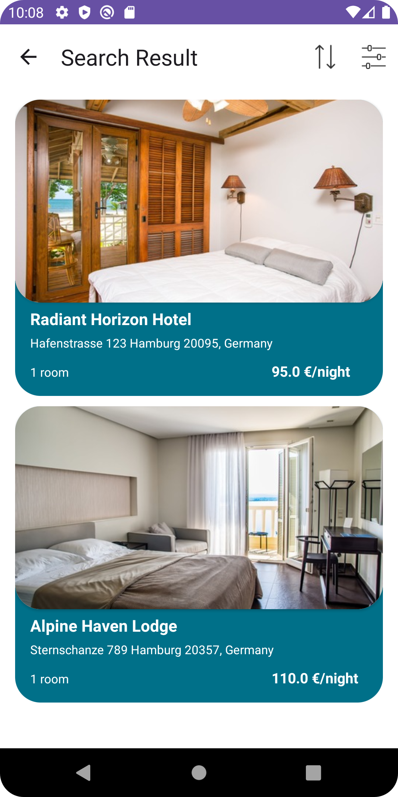
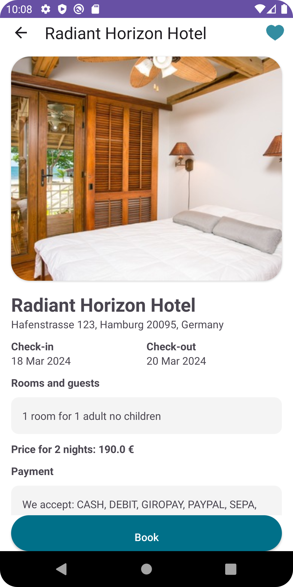
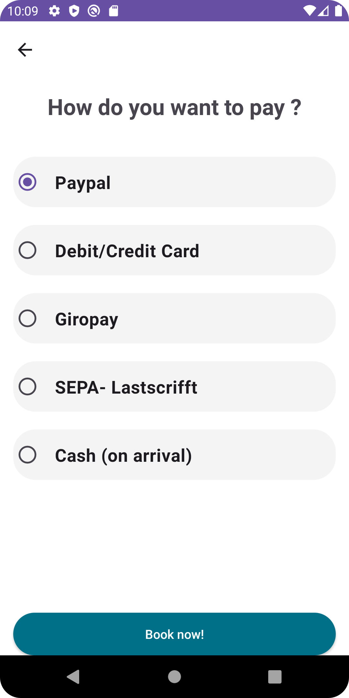

# Spacify
[](./README.md)
[](./README.de.md)

## Überblick

Spacify ist ein Prototyp, der mit dem Schwerpunkt auf einer überlegenen Benutzeroberfläche (UI) und Benutzererfahrung (UX) im Vergleich zu vorhandenen Anwendungen auf dem Markt entwickelt wurde. Der Prototyp verfügt über grundlegende Funktionen wie das Erstellen eines Kontos, das Verwalten von Benutzerinformationen und das Buchen eines Hotels. Die in diesem Prototyp verwendeten Daten sind rein fiktiv, und alle Hotels verweisen nicht auf echte Unternehmen. 

### Screenshots
    

    


## Getting Started
Diese Anleitung hilft Ihnen dabei, eine Kopie des Projekts auf Ihrem lokalen Rechner einzurichten und es für Entwicklungs- und Testzwecke zu verwenden.


### Vorraussetzungen
* Android Studio Hedgehog (or higher)
* Android SDK 34 
* Minimum Android device SDK 26


### Installation
1. Klone das Repository auf deinem lokalen Rechner:
```
git clone https://github.com/dinhthehuy/Spacify-Hotel-booking-app-prototype
```
2. Öffnen Sie das Projekt in Android Studio:
* Klicken Sie auf "Ein vorhandenes Projekt öffnen" oder navigieren Sie zu Datei > Öffnen....
* Wählen Sie den Ordner "HCIPrototypWS23" aus dem geklonten Verzeichnis aus.

3. Richten Sie den Emulator ein (optional):
* Wenn Sie kein physisches Android-Gerät haben, können Sie einen Emulator einrichten, um die App auszuführen.
* In Android Studio klicken Sie auf "Tools" > "AVD-Manager", um den Android Virtual Device (AVD) Manager zu öffnen.
* Erstellen Sie ein neues virtuelles Gerät mit SDK 26 oder höher, indem Sie auf die Schaltfläche "+ Virtuelles Gerät erstellen" klicken.

4. Build und die App ausführen:
* Sobald das Projekt in Android Studio geladen ist, warten Sie auf den Abschluss des Gradle-Buildvorgangs.
* Wenn Sie einen Emulator verwenden, stellen Sie sicher, dass er läuft und als das Zielgerät ausgewählt ist.
* Klicken Sie auf die grüne "Run" ▶️ Schaltfläche in der Symbolleiste oder gehen Sie zu "Run" > "Run 'app'".
* Android Studio wird die App erstellen und auf dem ausgewählten Gerät (Emulator oder physisches Gerät) installieren.


## Teammitglieder
* Dinh The Huy
* Sohayl Kaur
* Verrell Vimalaputra
* Le Thanh Trung
